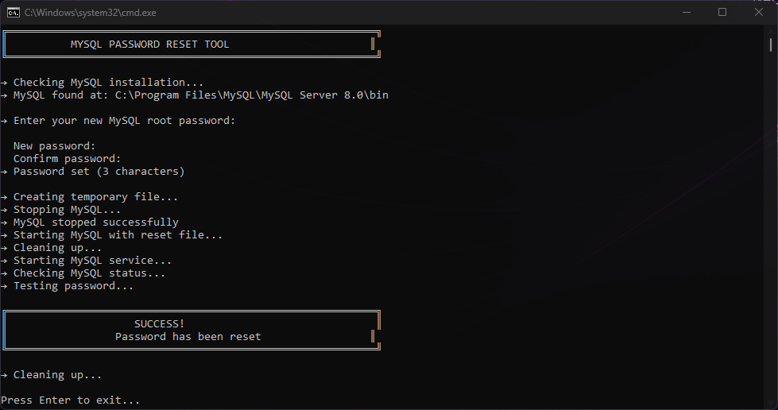

<h1 align="center">
  MySQL Password Reset Tool
  <br>
</h1>

<h4 align="center">Reset your forgotten MySQL root password safely in seconds</h4>

<p align="center">
  <a href="https://github.com/dredyne/mysql-password-reset/issues">
    
  </a>  
  <a href="https://github.com/dredyne/mysql-password-reset/pulls">
    
  </a>
  <a href="https://github.com/dredyne/mysql-password-reset/graphs/contributors">
    
  </a>
  <a href="https://github.com/sponsors/dredyne">
    
  </a>
</p>

<p align="center">
  <a href="#-quick-start">Quick Start</a> •
  <a href="#-prerequisites">Prerequisites</a> •
  <a href="#-troubleshooting">Troubleshooting</a> •
  <a href="#-safety">Safety</a> •
  <a href="#-Issues">Contributing</a> •
  <a href="#-license">License</a>
</p>

<p align="center">
  
</p>

---

## 🚀 Quick Start

**Windows:**
```bash
Right-click 'run.bat' → Run as administrator
```

**Mac/Linux:**
```bash
chmod +x run.sh
sudo ./run.sh
```

## ✅ Prerequisites

- Python installed
- MySQL installed
- Admin/sudo access
- Data backup (optional but recommended)

## 📁 Project Structure

```
├── run.bat          (Windows launcher)
├── run.sh           (Mac/Linux launcher)
├── src/main.py      (Reset tool)
├── README.md        (You are here)
└── LICENSE          (MIT License)
```

## ❓ Troubleshooting

| Issue | Solution |
|-------|----------|
| Python not found | Download from https://www.python.org/downloads/ |
| Permission denied | Use `sudo ./run.sh` |
| MySQL not found | Ensure MySQL is installed |

## 🔒 Safety

- Your password is **never saved** to disk
- Your password is **never logged** or sent anywhere
- All temporary files are **automatically deleted**
- You need admin rights to make this work (that's normal!)

## 🐛 Issues?

Found a bug? Report it: https://github.com/dredyne/mysql-password-reset/issues

## ❤️ Support This Project

- ⭐ Star the repo
- 💬 Share feedback
- 🤝 Sponsor: https://github.com/sponsors/dredyne

## 📄 License

MIT License - see [LICENSE](LICENSE) file for details

---

<div align="center"><sub>Built with ❤️ by <a href="https://github.com/dredyne">dredyne</a></sub></div>
